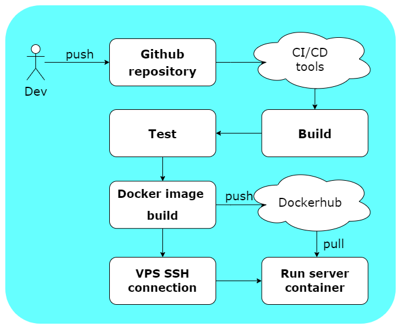
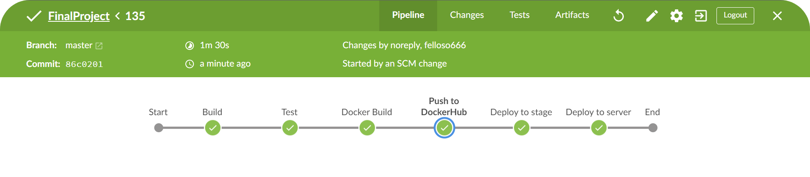
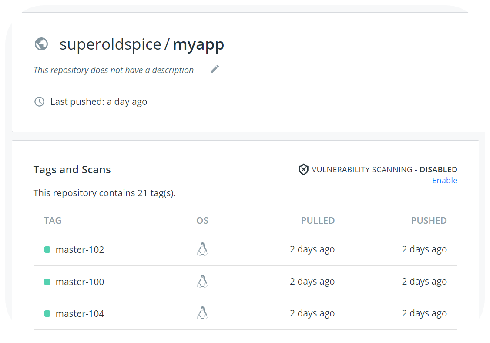
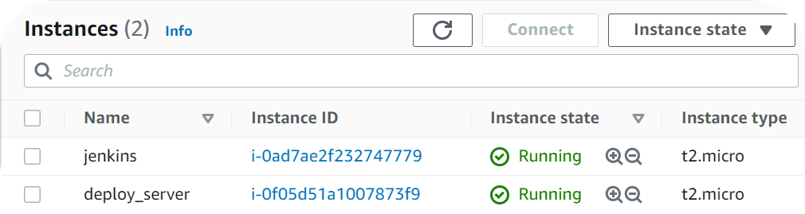
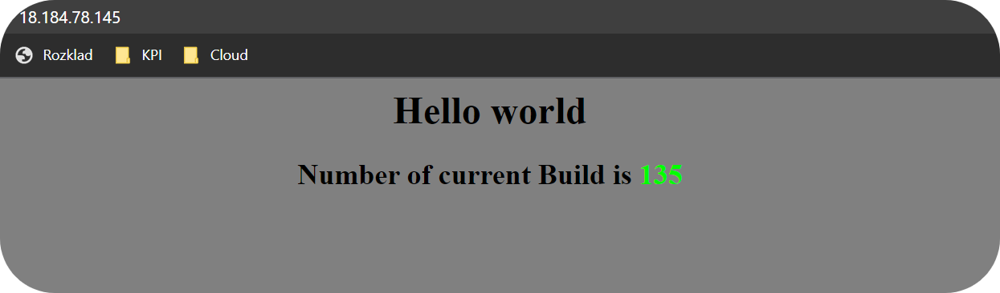

# [DevOps Final Project](https://github.com/SuperOldSpice/DevOpsFinalProject) 
***Dmytro Kubai***
[Click here to go to the DevOps Final Project repository](https://github.com/SuperOldSpice/DevOpsFinalProject) 

***

### CI/CD pipeline 

Project uses 
- Amazon Web Services for running tools and web server hosting
- GitHub as application source repository
- DockerHub as image storage
- Jenkins as CI/CD tool
- Docker for packaging, delivering and running application

***
 

### Problem
Developers team works on the web server application. It tries to implement new features as soon as possible and client wants to review them. The latest version of application must be regulary uploaded to server  

Developers work in their own environments and push code to github repository. But changes can lead to instability and every edit requires the app to be rebuild
  

### Solution 
Creating pipeline can make developing process much more efficient. Code will be automatically pulled from the repository, tested and builded in the defined environment    

Application container image will pe pushed to Dockerhub and deployed to the production server
  

### Pipeline stages 

  

### Pipeline overview

Pipeline steps overview in blueocean
  

### Dockerhub

Images with different versions of web app are stored into dockerhub repository
  

### AWS instances

All tool were run by AWS 
  

### Web server

Container running on the deploy server. To verify that pipeline works correctly It displayes the build number
