# Report task 2.1
**Dmytro Kubai**
## PART 1. HYPERVISORS ##
**There are two different types of hypervisors:**
Type 1 (bare metal): It runs directly on the host's hardware.
- Microsoft Hyper-V
- VMware ESX Server 
- Citrix XenServer

Type 2 (hosted): It runs on the host operating system.
- VMware Workstation
- Oracle VM VirtualBox
- Microsoft Virtual PC
- Parallels Desktop

Monolithic hypervisors have to host drivers for all hardware that they access. Drivers must be installed in the hypervisor. 

Microkernel hypervisors does not require the device drivers to be part of the hypervisor layer. Instead, drivers for the physical hardware are installed in the host operating system.

## PART 2. WORK WITH VIRTUALBOX ##
**1. First run VirtualBox and Virtual Machine (VM).** 
I downloaded VirtualBox and created virtual machine, installed the latest version of Ubuntu on it. I got acquainted with the possibilities of virtual machine control.

 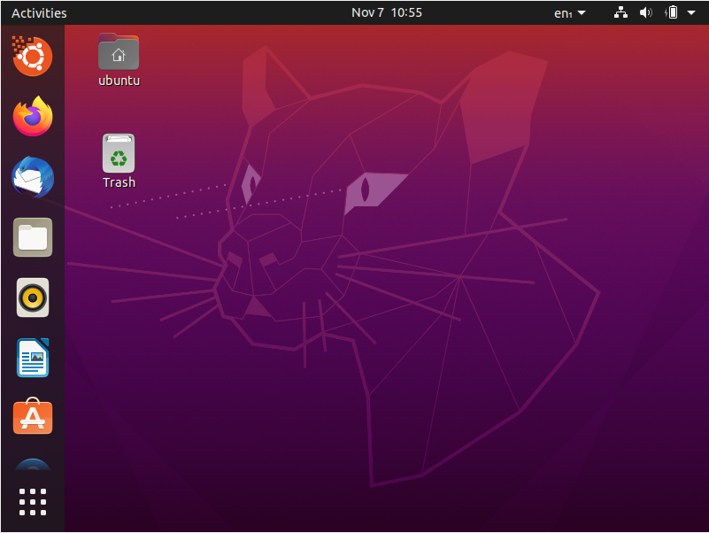

I created clone of VM1 and grouped them together.

 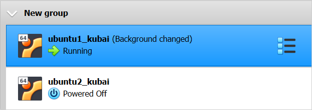

I installed updates, created some files, changed background. Changing the state of VM, I took snapshots.

 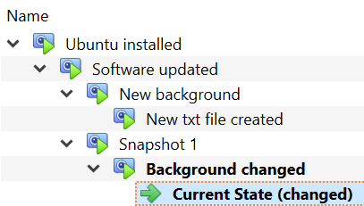

I exported VM1, saved *.ova file and then imorted it.

 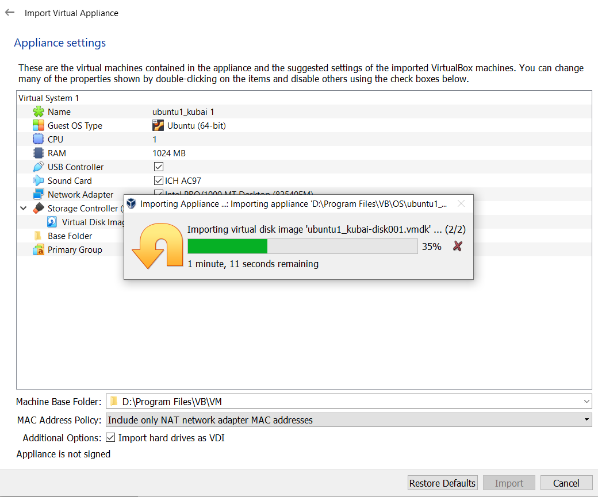

**2. Configuration of virtual machines** 
I connected my phone by usb to the VM.

 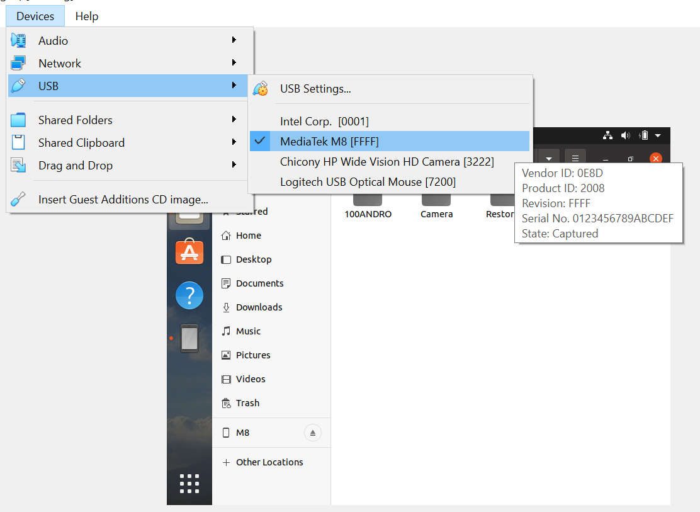

I installed Guest Addition and created shared folder.

 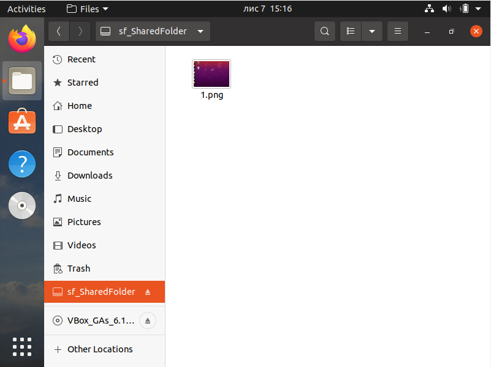

**3. Work with CLI through VBoxManage**
I opened the cmd command line and executed basic VBoxManage commands.
- Checked vms list

 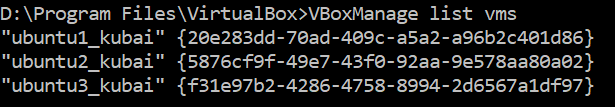

- Started vm

 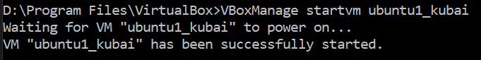

- Made snapshot

 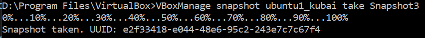

- Turned off vm

 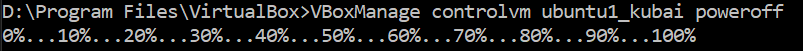

- Increased memory
 
 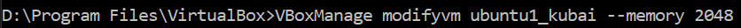

## PART 3. WORK WITH VAGRANT ##
I installed Vagrant, initialized the environment with the default Vagrant box.
 
 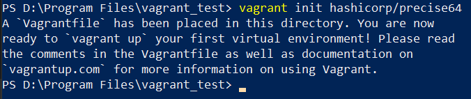

 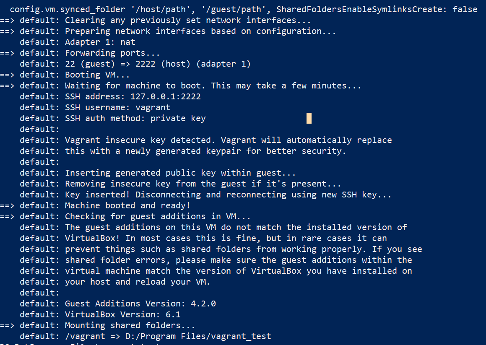

I used Putty to connect the virtual machine by ssh, recorded data and time, killed VM.

 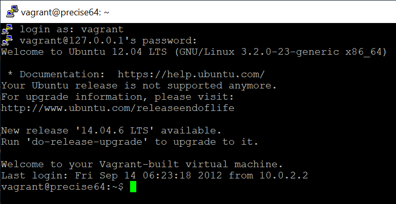

 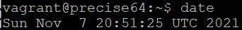

 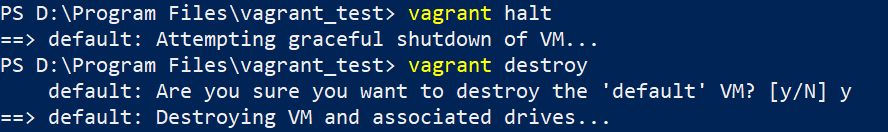
