# Report task 2.2

**Dmytro Kubai**

I registered an AWS Free Tier account. Then I started an Amazon Linux VM with Amazon Lightsail and connected to it.
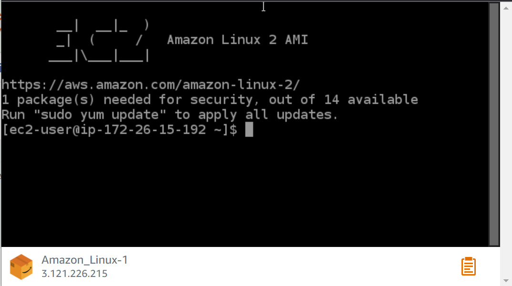
Then I launched another VM without Amazon Lightsail with t2.micro instance. 
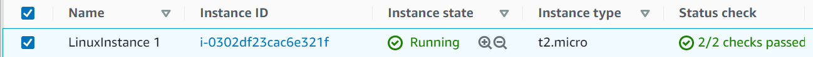
I saved ssh key, converted it by PuTTY key generator and connected to my VM with PuTTY.
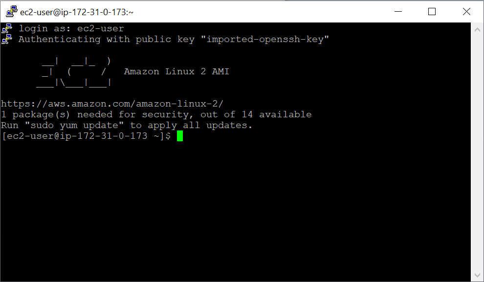
I created a new snapshot.
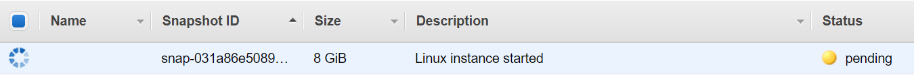
Created and attached Disk_D
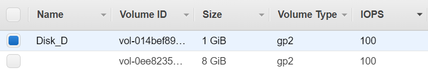
Created file system on new volume. Then i created data folder and mounted Disk_D on it.
```
sudo mount /dev/xvdf /data
```
Created few files 
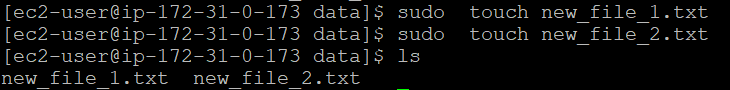
I created image from snapshot and launched a new instance, using it.
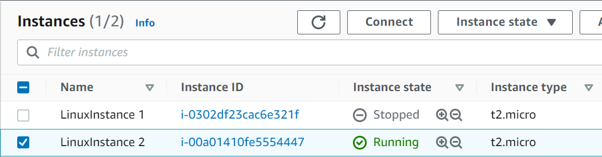

I detached disk D from old instance and attached it to the new VM.

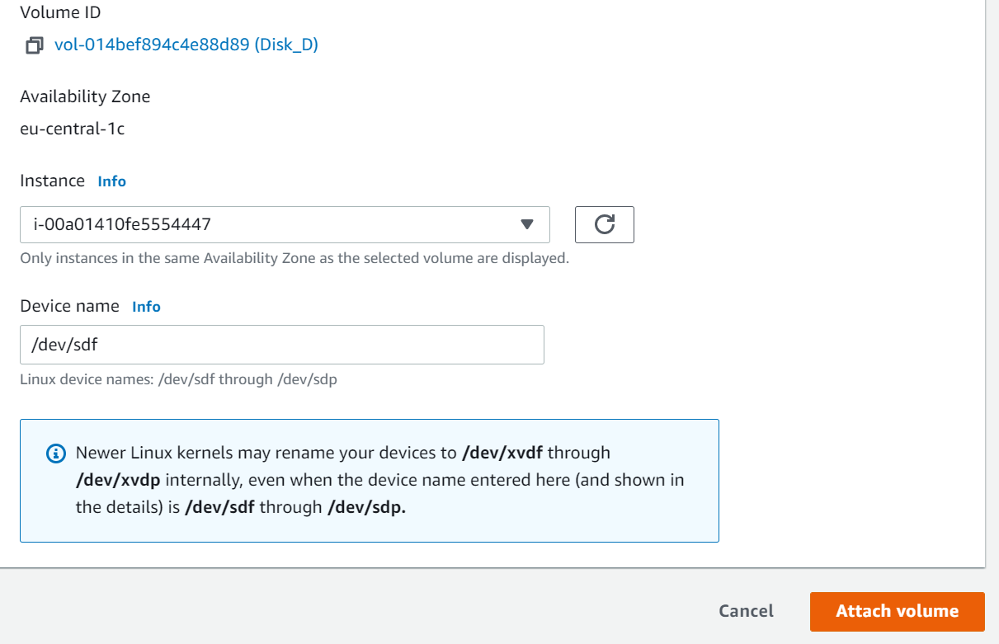
I mounted disk D to the directory data.
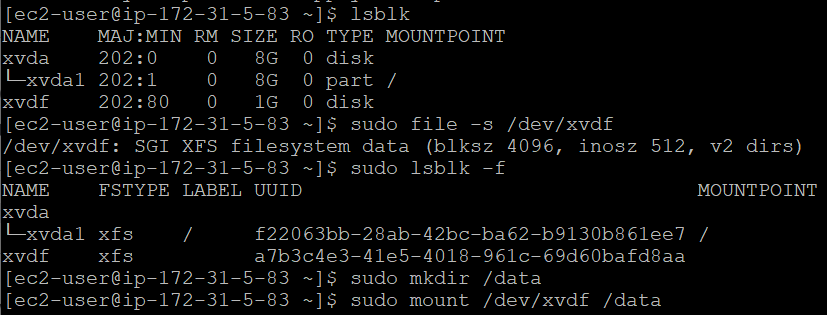
In folder data we can see files, which I have created on previous steps.
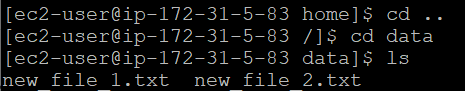
Launched WordPress instance with Amazon Lightsail
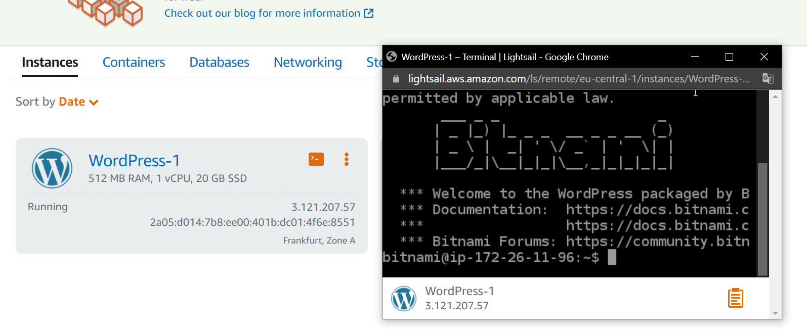
Created bucket and uploded a file to it.
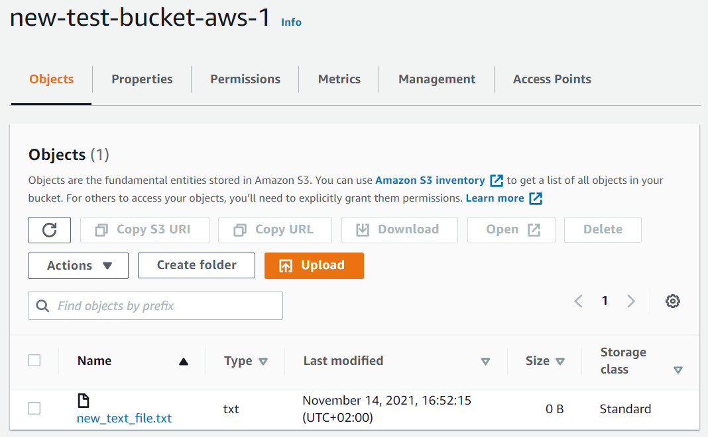
I created a user AWS IAM, configured CLI AWS and uploaded file to my bucket.
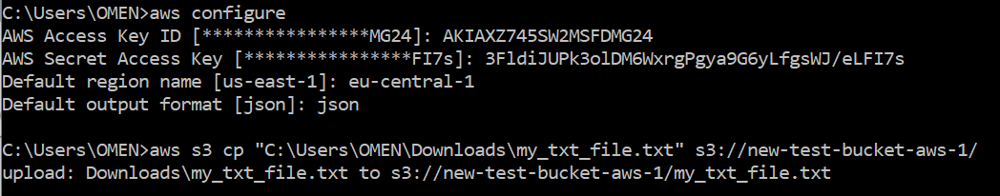