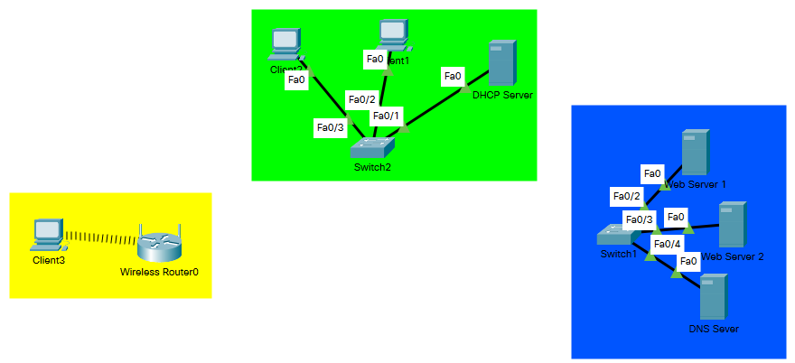

# Report task 3.1

**Dmytro Kubai**

I created networks as on pic. 1 
(screenshot was made after finishing task 3.1)

Created Enterprise VLAN and gave access to it.

Pinged server by client

Pinged network Enterprise

Created DataCenter VLAN

Pinged DataCenter VLAN

Inserted WI-FI module in the Client3 computer

Setted for Client3 static address and pinged router

