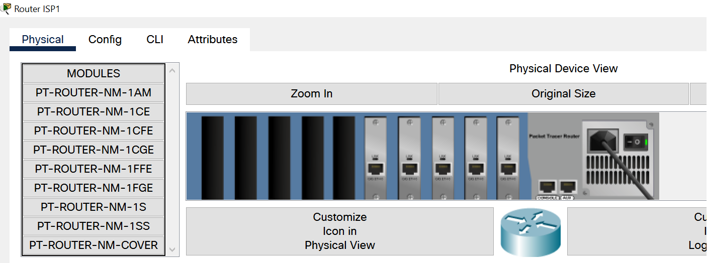
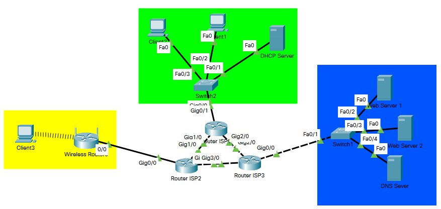
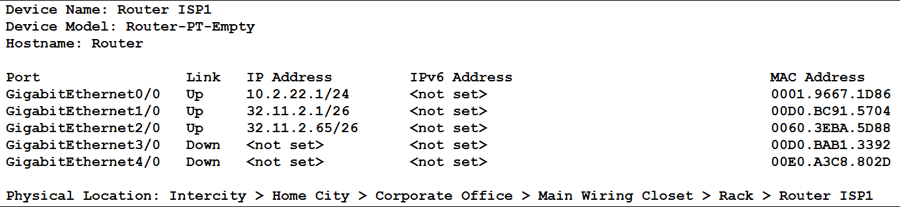
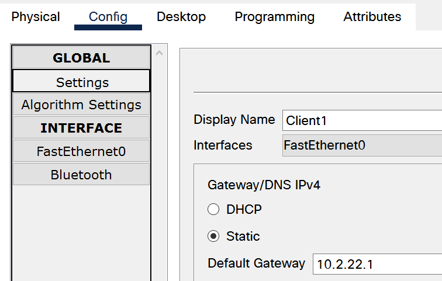
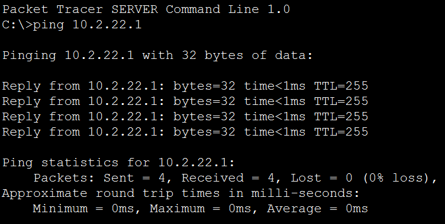
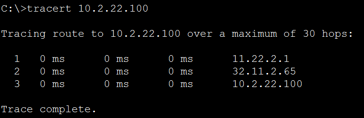
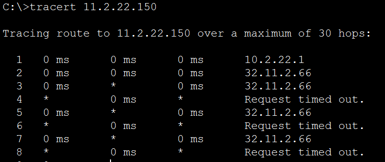

# Report task 3.2

**Dmytro Kubai**

I inserted 5 1CGE modules into routers and connected them together.

For internet realization created network 32.11.2.0 

Set defaul gateway 

Pinged gateway

Trace between DataCenter and Enterprise servers

I changed subnetwork mask to 255.255.255.192 and now I cant directly connect to the server, which has static ip address 11.22.2.150. It happens because mask /26 uses first two bits of last bite to define the subnetworks. Now servers belongs to different subnetworks and cant connect directly.

