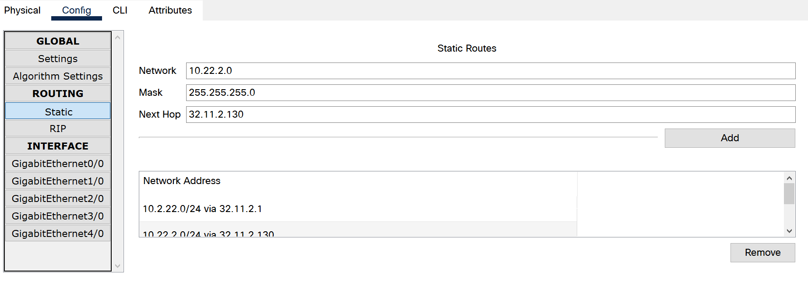
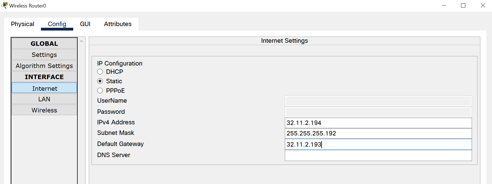
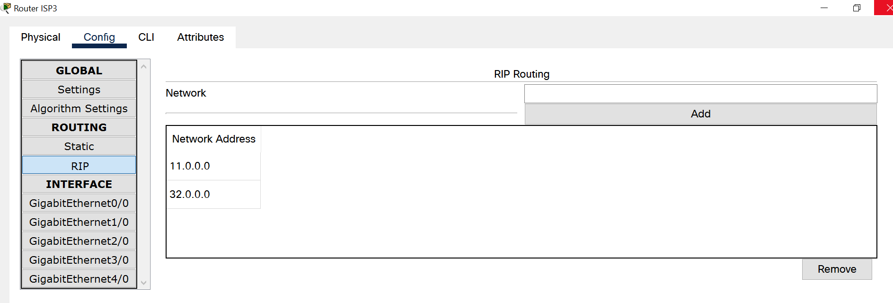
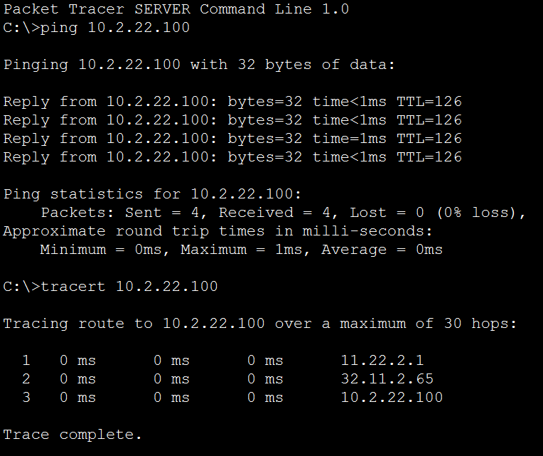

# Report task 3.3

**Dmytro Kubai**

Firstly, I created static routes.

Set up home router

Trace from Client1 to Web Server2

Deleted static routes, set up RIP protocol 

Checked network workability

