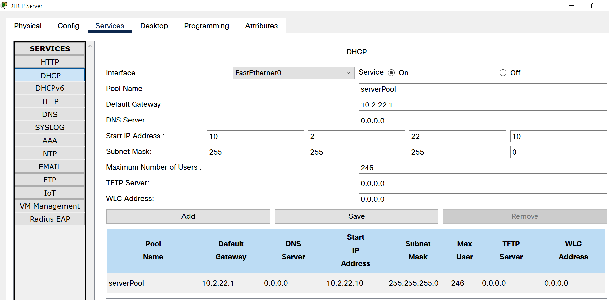
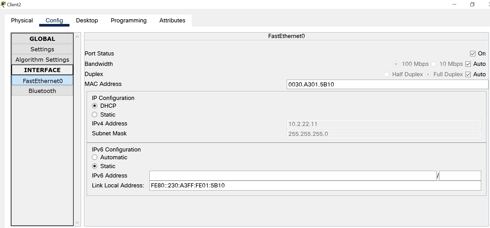
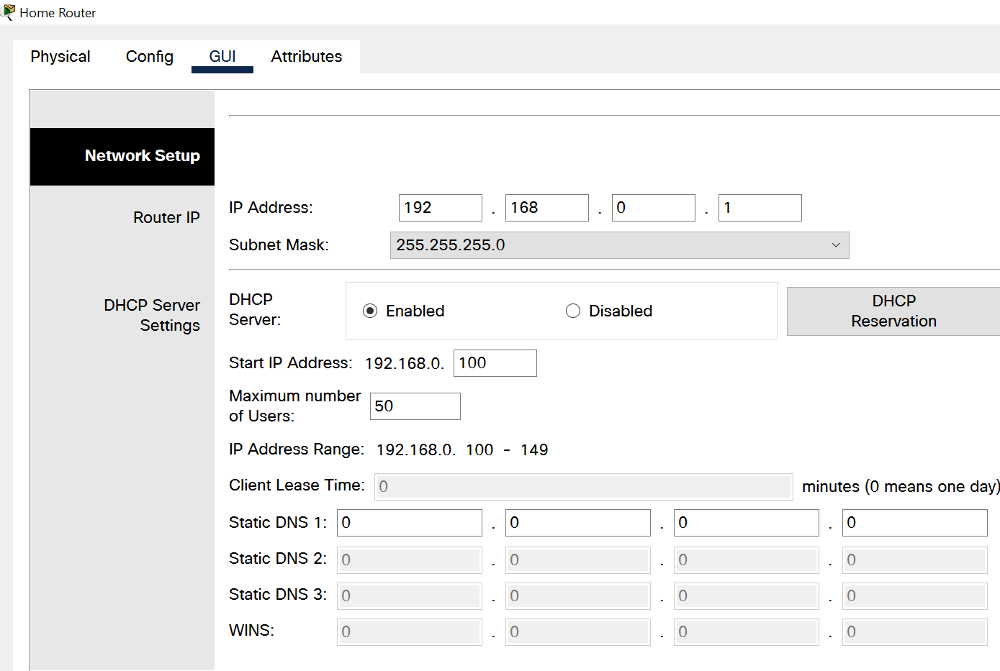
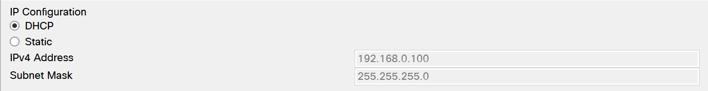
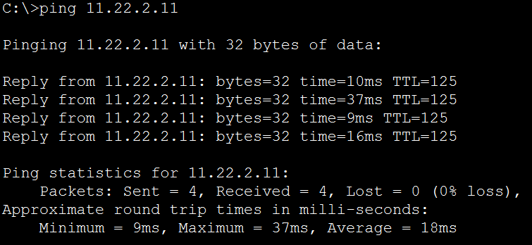
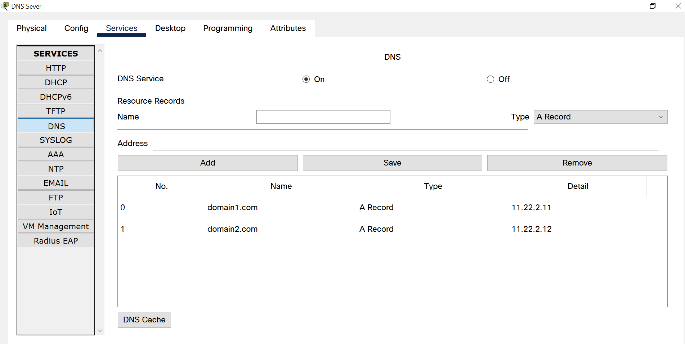
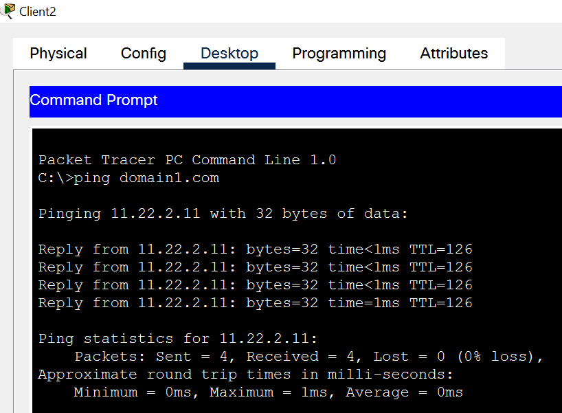

# Report task 3.4

**Dmytro Kubai**

Firstly I set up DHCP Pool for the DHCP Server in the Enterprise network 

Then set DHCP for the Clients PCs 

Set up DHCP server on home router

Client 3 automatically got the ip adress

It has connection to other networks

Added domains to DNS Server

Added DNS server address to DCHP server settings.
Refreshed DHCP address on clients and now I can ping web servers by their domains.

