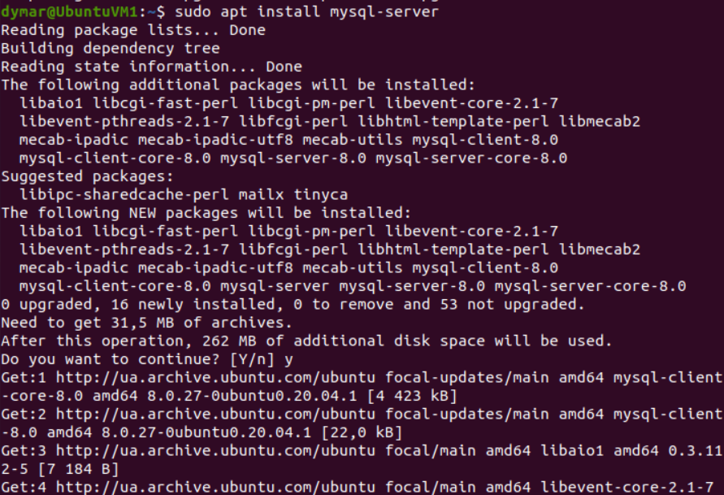
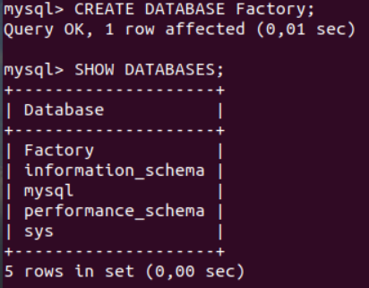
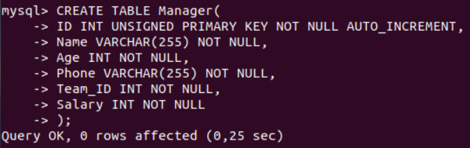
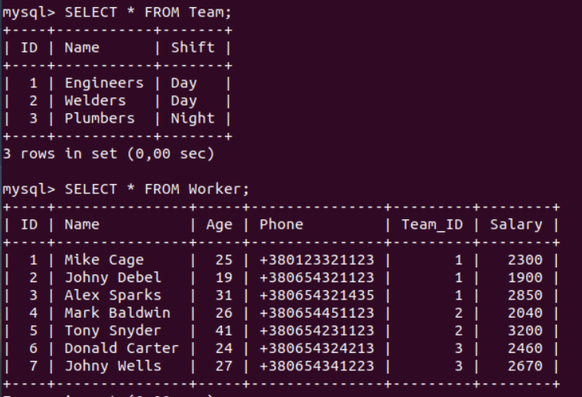

# Report task 4.1

**Dmytro Kubai**

### PART 1

Istalled MySQL

Factory database schema

Created Factory database 

Created tables

Filled tables

Team and Worker tables

Manager table

**Executed different SQL queries:**

Sorting querie

Grouping querie

Left join querie

Created user Mark, he could only make Select queries and Delete rows

He can not create new tables

Made selection from main table DB MySQL

### PART 2

Created new database dump 

Deleted two tables and most rows from third table

Restored database 

Created new DB in AWS RDS

Connected to AWS DB

Restored Factory database to remoted database

Executed the Select operator

Created a dump of remote database

### PART3

Created new DynamoDB table

Created new item 

My table

Query using Scan 

Query using Query

