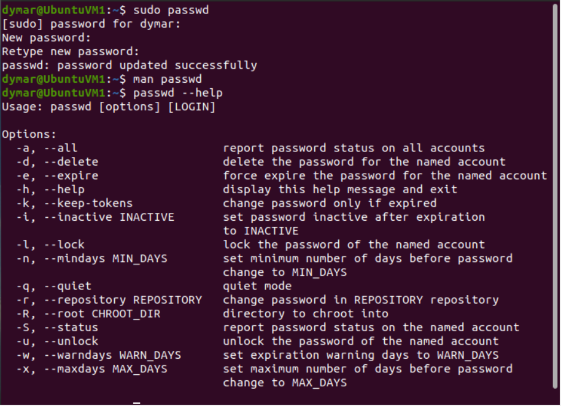
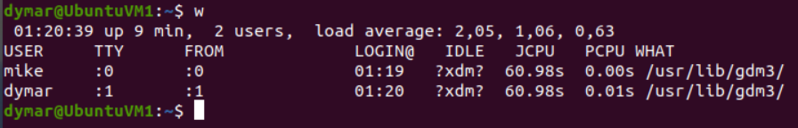
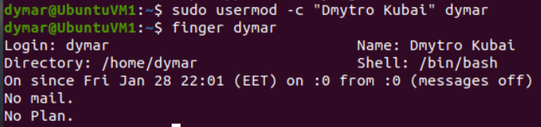
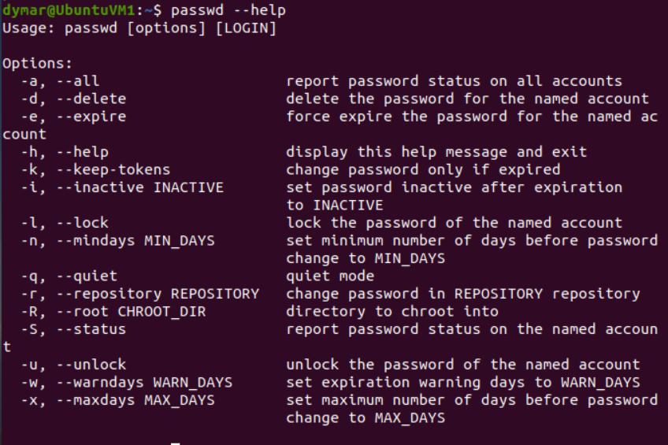
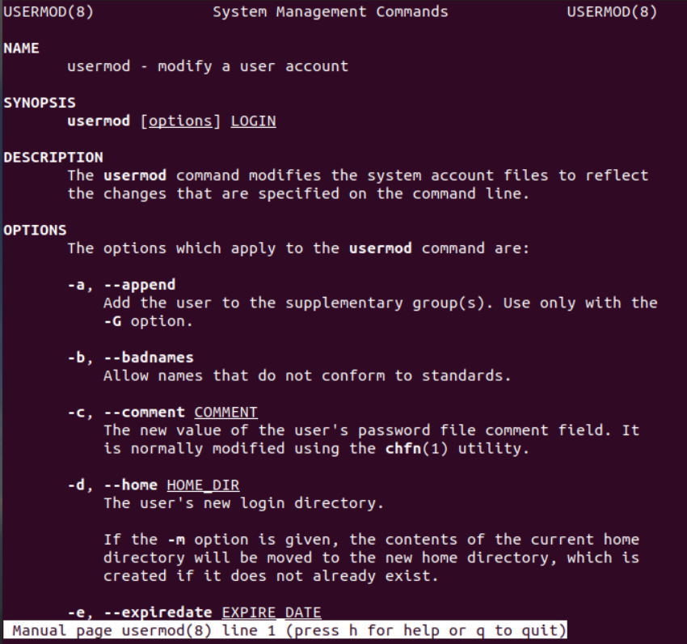
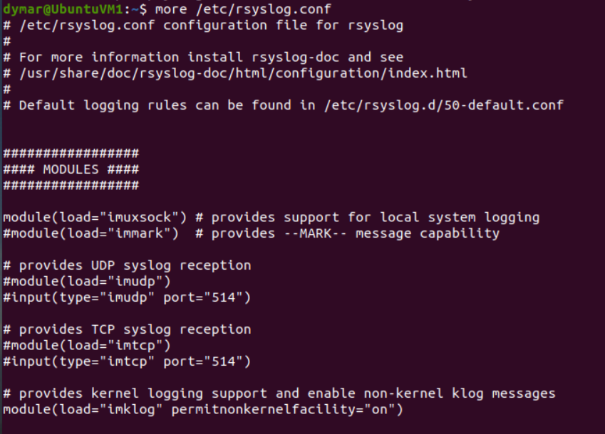
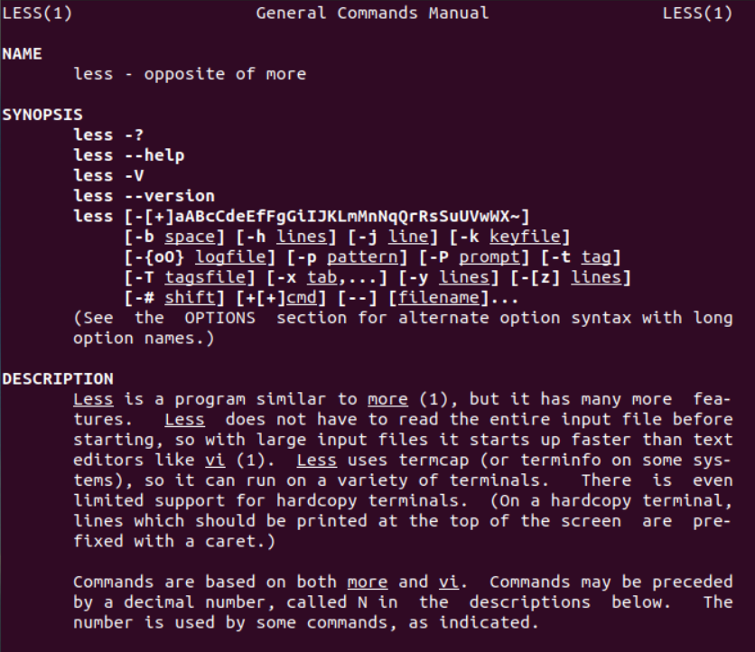

# Report task 5.1

**Dmytro Kubai**

# Part  1 

# 1-2 Log in to the system as root. Use the passwd command to change the password. Examine the basic parameters of the command. What system file does it change *?

I logged into systeam as root user. And then changed my password with `passwd` command. This command changes the /etc/passwd file, which stores user account information.

#3) Determine the users registered in the system, as well as what commands they execute. What additional information can be gleaned from the command execution?

I checked list of the users 

Command displays too:
- The current system time.
- The length of time the system has been up.
- The number of logged-in users.
- The system load averages for the past 1, 5, and 15 minutes. (the number of jobs that are currently running or waiting for disk)
- USER – The name of the logged user.
- TTY – The name of the terminal used by the user.
- FROM – The host name or IP address from where the user is logged in.
- LOGIN@ – The time when the user logged in.
- IDLE – The time since the user last interacted with the terminal. Idle time.
- JCPU – The time used by all processes attached to the tty.
- PCPU – The time used by the user’s current process. The one displayed in the WHAT field.
- WHAT – The user’s current process and options/arguments.

# 4) Change personal information about yourself.

# 5) Become familiar with the Linux help system and the man and info commands. Get help on the previously discussed commands, define and describe any two keys for these commands. Give examples.

# 6) Explore the more and less commands using the help system. View the contents of files .bash* using commands.

