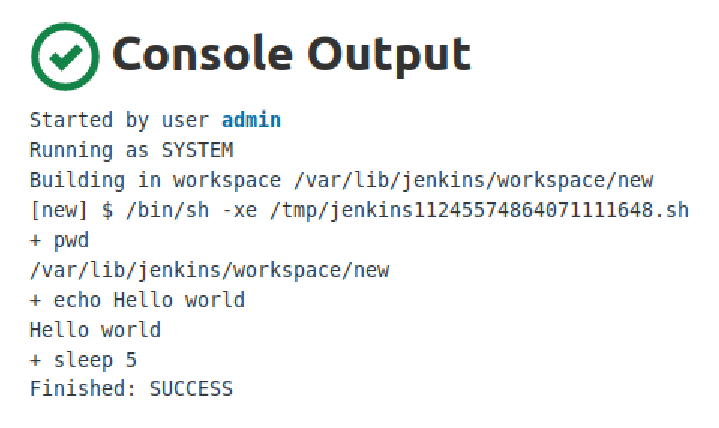
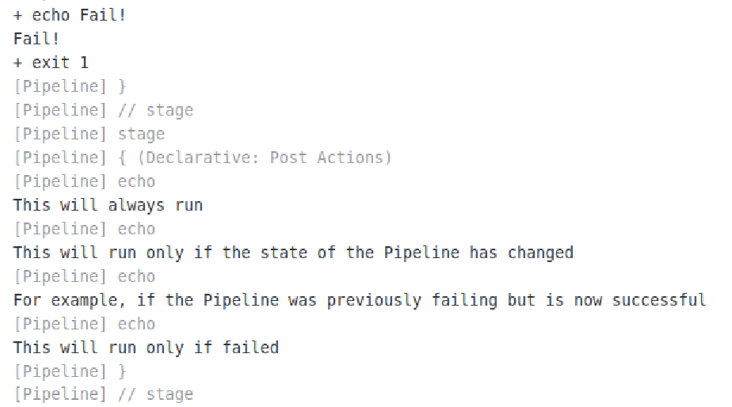

# Report task 9

**Dmytro Kubai**

I installed jenkins on my VM and run simple freestyle project 

Continued learning Pipeline Syntax and created jenkinsfile manually and pushed to my repo 

Logs

